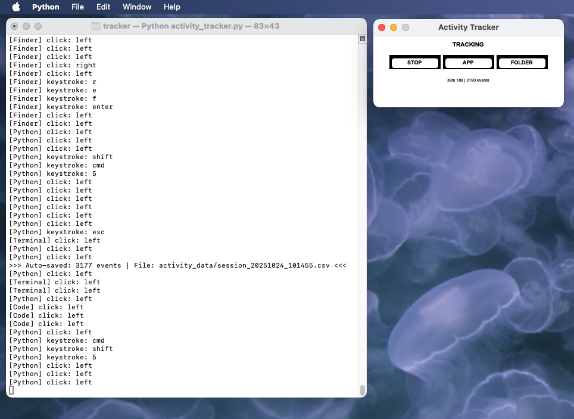

# Activity Tracker

A lightweight, cross-platform desktop application that monitors your keyboard and mouse activity in real-time.

Track every keystroke and click, see which applications you use most, and analyze your computer usage patterns over time.

---



## What It Does

**Activity Tracker** runs quietly in the background and records:

- **Every keystroke** you type
- **Every mouse click** you make (left, right, middle)
- **Which application** you're using when each event happens
- **Precise timestamps** for every action

All data is saved locally to CSV files that you can analyze later.

---

## Key Features

### **Simple & Minimal**
- Clean black and white interface
- Compact 320x120 window
- Clock + Event counter
- Three buttons: 
  - STOP/START | activate / de-activated tracking
  - APP/GLOBAL | switch between app-specific / global tracking
  - FOLDER | open folder containing saved data

### **Smart Data Collection**
- Tracks by application OR globally
- Auto-saves every 60 seconds
- Session-based storage (one file per session)
- CSV format for easy analysis (~50% smaller than JSON!)

### **Privacy First**
- No cursor position tracking
- No screenshots or screen content
- 100% offline - no internet connection
- All data stays on your computer

### **Customizable**
- Edit colors at top of script
- Change fonts and sizes
- Adjust window dimensions
- Set auto-save interval

---

## Installation

### Requirements

- **macOS** (Windows/Linux compatible with minor tweaks)
- **Python 3.11** ⚠️ **Important: Must use 3.11, NOT 3.14!**
- **Homebrew** (for macOS dependencies)

### Step 1: Install Python 3.11

```bash
# Uninstall Python 3.14 if you have it
brew uninstall python@3.14

# Install Python 3.11 (required for compatibility)
brew install python@3.11

# Install python-tk for 3.11
brew install python-tk@3.11
```

**Why Python 3.11?** Python 3.14 is too new and has compatibility issues with pynput. Python 3.11 is the stable, tested version that works perfectly.

### Step 2: Install Python Packages

```bash
pip3.11 install pynput pillow --break-system-packages
```

**Note:** The `--break-system-packages` flag is safe for local projects like this.

### Step 3: Download the Script

Save `activity_tracker.py` to a folder on your computer.

### Step 4: Grant Permissions (macOS Only)

The app needs permission to monitor keyboard and mouse:

1. Run the app once: `python3.11 activity_tracker.py`
2. Go to **System Preferences** → **Security & Privacy** → **Privacy**
3. Select **Accessibility** from the left sidebar
4. Click the lock 🔒 and enter your password
5. Click **+** and add Python 3.11:
   - Press **Cmd + Shift + G**
   - Paste: `/opt/homebrew/Cellar/python@3.11/3.11.14/Frameworks/Python.framework/Versions/3.11/Resources/Python.app`
   - Click **Open**
6. Check the box ✓ next to Python
7. Do the same for **Input Monitoring**
8. Restart the app

---

## Building a Standalone App (Optional)

Want to run Activity Tracker as a double-clickable macOS app without opening Terminal? Follow these steps to build a standalone `.app` bundle.

### Requirements

- Everything from the Installation section above
- **py2app** package for building macOS apps

### Step 1: Install py2app

```bash
pip3.11 install py2app --break-system-packages
```

### Step 2: Build the App

Navigate to the folder containing `activity_tracker.py` and `setup.py`:

**Option A: Alias Mode (Recommended)**

```bash
cd /path/to/tracker
python3.11 setup.py py2app -A
```

Alias mode creates a lightweight app that links to your source files. This is faster, more reliable, and easier to debug.

**Option B: Full Bundle**

```bash
cd /path/to/tracker
python3.11 setup.py py2app
```

Full bundle mode packages everything into the app. Use this if you want to share the app or move it away from the source folder.

Both commands will:
- Create a `build/` folder (temporary files)
- Create a `dist/` folder containing **Activity Tracker.app**

### Step 3: Move the App

```bash
# Move the app to your Applications folder
mv dist/Activity\ Tracker.app /Applications/

# Or open the dist folder to drag it manually
open dist/
```

### Step 4: First Launch

1. Open **Finder** and go to **Applications**
2. Find **Activity Tracker.app**
3. **Right-click** (or Ctrl+click) and select **Open**
4. Click **Open** in the security dialog (first launch only)

macOS will ask for accessibility permissions just like running from Terminal. Follow the permission steps from the Installation section above.

### Using the Standalone App

Once built and moved to Applications:

- **Double-click** to launch (no Terminal needed!)
- The app runs identically to the Python script
- Data still saves to `activity_data/` which is now located within the package contents folder
- Click FOLDER button to open the data directory

### Cleaning Up Build Files

After building, you can delete the temporary files:

```bash
cd /path/to/tracker
rm -rf build/ dist/
```

Keep `setup.py` if you want to rebuild in the future.

### Rebuilding After Code Changes

If you modify `activity_tracker.py`:

**For alias mode builds:**
```bash
# Just rebuild - changes are automatically reflected!
python3.11 setup.py py2app -A
```

**For full bundle builds:**
```bash
# Clean old build
rm -rf build/ dist/

# Rebuild
python3.11 setup.py py2app

# Move new version
mv dist/Activity\ Tracker.app /Applications/
```

**Note:** With alias mode, the app links to your source files, so code changes take effect immediately without rebuilding!

### Troubleshooting

**"Activity Tracker.app" is damaged and can't be opened**
- This happens when macOS can't verify the app
- Right-click → Open instead of double-clicking
- Or run: `xattr -cr /Applications/Activity\ Tracker.app`

**App doesn't start / crashes immediately**
- Check that you built with Python 3.11 (not 3.14)
- Verify all dependencies are installed
- Try running the Python script directly to see error messages

**Missing icon**
- Make sure the icon file exists at the path specified in `setup.py`
- Or remove the `'iconfile'` line to use the default Python icon

**Data folder not found**
- The app creates `activity_data/` relative to where it's located
- When in Applications, this will be `/Applications/activity_data/`
- Consider modifying the script to use a fixed home directory path

---


## How to Use

### Starting the Tracker

```bash
cd /path/to/tracker
python3.11 activity_tracker.py
```

The app will:
- Open a small window
- Start tracking immediately
- Print each event to the terminal
- Auto-save every 60 seconds

### The Interface

```
┌─────────────────────────┐
│      TRACKING           │
│                         │
│  [STOP] [APP] [FOLDER]  │
│                         │
│   2m 30s | 145 events   │
└─────────────────────────┘
```

**STOP/START** - Toggle tracking on/off

**APP/GLOBAL** - Switch modes:
- **APP mode**: Track which application each event belongs to
- **GLOBAL mode**: Track all events without app names

**FOLDER** - Opens the `activity_data` folder in Finder

**Important:** The listeners run continuously in the background. When you click STOP, it saves the current session but keeps monitoring. When you click START, it begins a new session.

### Reading the Data

All sessions are saved as CSV files in the `activity_data/` folder:

```
activity_data/
  ├── session_20251023_143500.csv
  ├── session_20251023_150200.csv
  └── session_20251023_152700.csv
```

Each CSV file contains:

```csv
timestamp,app,event_type,key
2025-10-23T15:35:00.123456,Chrome,keystroke,h
2025-10-23T15:35:00.234567,Chrome,keystroke,e
2025-10-23T15:35:00.345678,Chrome,click,left
```

### Terminal Output

Clean, one-line-per-event format:

```
Activity Tracker Started
========================================
Tracking started... Session ID: 20251023_143500
Creating listeners for the first time...
✓ Keyboard listener started
✓ Mouse listener started
[Chrome] keystroke: h
[Chrome] keystroke: e
[Chrome] keystroke: l
[Chrome] click: left
>>> Auto-saved: 245 events | File: activity_data/session_20251023_143500.csv <<<
```

---


## Data Format

### CSV Structure

| Column | Description | Example |
|--------|-------------|---------|
| `timestamp` | ISO 8601 timestamp | `2025-10-23T15:35:00.123456` |
| `app` | Application name | `Chrome`, `Finder`, `Global` |
| `event_type` | Type of event | `keystroke` or `click` |
| `key` | Specific key or button | `a`, `space`, `left`, `right` |

### File Naming

Files are named with session start time:

```
session_YYYYMMDD_HHMMSS.csv
        │       │
        │       └─ Hour, minute, second
        └───────── Year, month, day
```

### File Size

Approximate file sizes:

- **1 hour of light use**: ~50 KB
- **1 hour of heavy typing**: ~200 KB
- **8 hour work day**: ~500 KB - 1 MB

CSV format is 50% smaller than JSON!

---


## Use Cases

### Analytics + Productivity
- Track your daily computer usage patterns
- Measure typing speed and activity levels
- Measure time spent in different applications / see which apps you use most
- Track breaks and active periods / find your most productive hours

### Data Analysis Projects
- Import CSVs into Excel, Python, R
- Create visualizations and charts
- Build custom activity dashboards
- Train machine learning models

---

## Customization

### Changing Colors

Edit the settings at the top of `activity_tracker.py`:

```python
# Background
BG_COLOR = "#FFFFFF"  # White

# Button colors
BUTTON_STOP_BG = "#FFFFFF"  # White buttons
BUTTON_TEXT_COLOR = "#000000"  # Black text
BUTTON_BORDER_COLOR = "#000000"  # Black border

# Status colors
STATUS_TRACKING_COLOR = "#000000"  # Black
STATUS_STOPPED_COLOR = "#000000"  # Black
```

### Changing Window Size

```python
WINDOW_SIZE = "320x120"  # Width x Height
```

### Changing Auto-Save Interval

```python
self.tracker = ActivityTracker(autosave_interval=60)  # seconds
```

Change `60` to any number of seconds.

### Changing Fonts

```python
FONT_FAMILY = "Arial"
FONT_SIZE_STATUS = 10
FONT_SIZE_BUTTON = 9
```

---

## Troubleshooting

### "Module not found" error

Install dependencies with Python 3.11:
```bash
pip3.11 install pynput pillow --break-system-packages
```

### App crashes on startup

Make sure you have Python 3.11 AND python-tk:
```bash
brew install python@3.11
brew install python-tk@3.11
```

### Keyboard tracking not working

Common issue! The keyboard listener may show an error in the thread but still work. Check:

1. You're using Python 3.11 (not 3.14)
2. Python has **Accessibility** permissions
3. Python has **Input Monitoring** permissions
4. Run the app and type - events should appear even if there's an error message

If you see this error, it's usually fine:
```
Exception in thread Thread-2:
...
KeyError: 'AXIsProcessTrusted'
```

The keyboard listener still works despite the error!

### Start/Stop button crashes the app

This should be fixed in the current version. The listeners now run continuously in the background and don't restart.

### No events being recorded

Check that:
1. Status shows "TRACKING" (not "STOPPED")
2. You've granted system permissions
3. The terminal shows event lines
4. You're using Python 3.11

### "externally-managed-environment" error

Use the `--break-system-packages` flag:
```bash
pip3.11 install pynput pillow --break-system-packages
```

---

## Privacy & Security

### What Gets Recorded

✅ **YES** - Key presses (which key)

✅ **YES** - Mouse clicks (which button)

✅ **YES** - Application names

✅ **YES** - Timestamps

❌ **NO** - Screenshots or screen content

❌ **NO** - Cursor positions

❌ **NO** - Window titles or URLs

❌ **NO** - File paths or documents

### Data Storage

- All data stored **locally** on your computer
- No cloud sync or remote servers
- No internet connection required
- You control your own data
- Delete files anytime to remove data

### Permissions

The app requires system permissions to:
- Monitor keyboard input (Accessibility + Input Monitoring)
- Monitor mouse input (Accessibility)
- Get active application name

It does **NOT** require:
- Screen recording
- File system access (except its own folder)
- Network access
- Camera or microphone

---

## Technical Details

### Architecture

```
┌─────────────────────────────────────┐
│  GUI (Tkinter)                      │
│  - Display window                   │
│  - Update stats                     │
│  - Control buttons                  │
└──────────────┬──────────────────────┘
               │
┌──────────────▼──────────────────────┐
│  ActivityTracker                    │
│  - Record events                    │
│  - Manage sessions                  │
│  - Save to CSV                      │
└──────────────┬──────────────────────┘
               │
┌──────────────▼──────────────────────┐
│  Listeners (pynput)                 │
│  - Keyboard monitoring              │
│  - Mouse monitoring                 │
│  - Run continuously                 │
└─────────────────────────────────────┘
```

### Threading Model

- **Main Thread**: GUI and display updates
- **Keyboard Thread**: Monitors keyboard (runs continuously)
- **Mouse Thread**: Monitors mouse (runs continuously)
- **Tracking Thread**: Starts/stops recording (not listeners)

**Important:** Listeners run continuously. Stop/Start only controls whether events are recorded, not whether listeners are active.

### Performance

- **Memory**: ~20-30 MB RAM usage
- **CPU**: <1% when idle, 2-5% during heavy typing
- **Storage**: ~1 MB per 8-hour workday

### Known Issues

1. **Keyboard thread error on startup**: The keyboard listener may show a `KeyError: 'AXIsProcessTrusted'` error but will still work. This is a known pynput/macOS compatibility issue that doesn't affect functionality.

2. **Python 3.14 incompatibility**: pynput has breaking issues with Python 3.14. Always use Python 3.11.

3. **Listeners can't restart**: pynput listeners can't be stopped and restarted. This is why we keep them running continuously and just toggle the recording flag.

---

## FAQ

**Q: Does this track passwords?**

A: No. But also YES. This program will monitor your keyboard input, which means that your passwords / login information will be recorded (one keystroke at a time). It is up to the user to decide what happens with the recorded data. If you are tracking activity and need to type a sensistive string, you can always STOP tracking temporarily. The program itself does not recognize words or phrases- only keystrokes.

**Q: Why must I use Python 3.11?**

A: Python 3.14 is too new and pynput hasn't been updated for it yet. Python 3.11 is the stable, tested version.

**Q: Why do I see a keyboard thread error?**

A: This is a known macOS/pynput compatibility issue. The error appears but keyboard tracking still works! You can safely ignore it.

**Q: Can I see my typing speed?**

A: Yes! Count the keystroke events per minute in the CSV files. Future versions may include an auto-analysis for typing speed and clicks-per-minute.

**Q: How do I stop tracking?**

A: Click the "STOP" button. Note: the listeners keep running in the background, but events won't be recorded.

**Q: Can I delete old data?**

A: Yes. Just delete CSV files from the `activity_data` folder.

**Q: Can I run this 24/7?**

A: Yes! It's designed to run continuously. Data auto-saves every minute.

**Q: Will this slow down my computer?**

A: No. It uses minimal resources and runs efficiently in the background.

---

## Credits

Code by Claude
Prompts + edits by Traversable Dale 
(October 2025)

Built with:
- **Python 3.11** - Core language
- **Tkinter** - GUI framework
- **pynput** - Input monitoring
- **Pillow** - Image support (future features)

---

## License

Free to use for personal and educational purposes.

---

**Happy Tracking!**