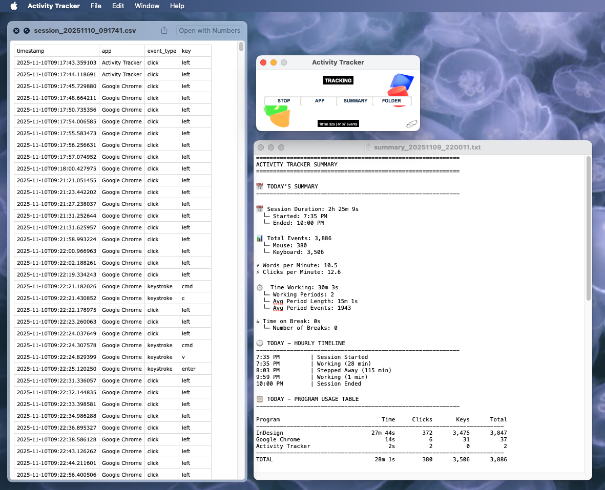

# Activity Tracker
### Cross-Platform Activity Monitor

**Version 0.2.0** | Updated February 15, 2026

A lightweight desktop app that tracks keyboard and mouse activity by application. Analyze your computer usage patterns with detailed reports.



---

## Quick Start

### macOS

```bash
brew install python@3.11 python-tk@3.11
pip3.11 install pynput pillow --break-system-packages
python3.11 activity_tracker.py
```

**Grant permissions:** System Preferences → Security & Privacy → Accessibility + Input Monitoring → Add Python 3.11

### Windows

```bash
pip install pynput pillow pywin32 psutil
python activity_tracker.py
```

No special permissions needed.

---

## What It Does

Activity Tracker monitors your keyboard and mouse input, records which application is active, and saves everything to local CSV files. It generates detailed reports with stats like words per minute, clicks per minute, time per application, work periods, and break patterns.

Keystroke categories (char, separator, modifier) are recorded instead of raw text, so your actual typing is never captured.

### Features

- Compact 320x120 window with PAUSE, SUMMARY, FOLDER buttons
- Auto-save every 30 seconds
- Analytics: WPM, CPM, work periods, breaks, time per app
- Reports in TXT and CSV formats
- 100% offline — all data stays on your computer
- Customizable colors, fonts, and window size

---

## Usage

### Interface

```
┌──────────────────────────────────────┐
│           TRACKING                   │
│                                      │
│  [PAUSE]  [SUMMARY]  [FOLDER]       │
│                                      │
│       2m 30s | 145 events            │
└──────────────────────────────────────┘
```

- **PAUSE/RESUME** — Temporarily stop recording (for privacy)
- **SUMMARY** — Generate analytics report (TXT + CSV)
- **FOLDER** — Open data directory

### Data Output

CSV files saved to `activity_data/`:

```csv
timestamp,app,event_type,key
2026-02-14T15:35:00.123456,chrome.exe,keystroke,char
2026-02-14T15:35:00.234567,chrome.exe,keystroke,separator
2026-02-14T15:35:00.345678,chrome.exe,click,left
```

Reports saved to `activity_data/reports/`:
- `summary_YYYYMMDD_HHMMSS.txt` — Human-readable
- `summary_YYYYMMDD_HHMMSS.csv` — Machine-readable (for TouchDesigner, etc.)

---

## Building Standalone Apps

### macOS

```bash
pip3.11 install py2app --break-system-packages
python3.11 setup.py py2app -A
mv dist/Activity\ Tracker.app /Applications/
```

**First launch:** Right-click → Open (to bypass security prompt)

### Windows

Building a distributable Windows installer uses PyInstaller + Inno Setup.

```bash
# Build the exe
python -m PyInstaller ActivityTracker.spec

# Then compile installer-setup-custom.iss in Inno Setup (F9)
```

For the full walkthrough, see [ref/README_WINDOWS.md](ref/README_WINDOWS.md).

---

## Privacy & Security

### What Gets Recorded
- Keystroke categories (char/separator/modifier)
- Mouse clicks (which button)
- Application names
- Timestamps

### What Is Never Recorded
- Screenshots or screen content
- Cursor positions
- Window titles or URLs
- Raw text (what you actually typed)

All data stored locally as plain CSV files. No internet connection. No network calls. You can pause tracking at any time and inspect or delete your data freely.

---

## Customization

Edit settings at top of `activity_tracker.py`:

```python
WINDOW_SIZE = "320x120"
BG_COLOR = "#FFFFFF"
BUTTON_PAUSE_BG = "#9C2D2D"
STATUS_TRACKING_COLOR = "#FFFFFF"
FONT_FAMILY = "Arial"
FONT_SIZE_STATUS = 10
```

---

## Troubleshooting

**Module not found error**
```bash
# macOS
pip3.11 install pynput pillow --break-system-packages

# Windows
pip install pynput pillow pywin32 psutil
```

**macOS: Keyboard not tracking** — Grant Accessibility + Input Monitoring permissions. Use Python 3.11 (not 3.14). Keyboard listener may show an error but still work.

**Windows: No events recorded** — Make sure app shows "TRACKING" status. Check `activity_data/debug.log` for errors.

---

## Technical Details

- **Language:** Python 3.11
- **GUI:** Tkinter
- **Input Monitoring:** pynput
- **Windows Build:** PyInstaller + Inno Setup
- **macOS Build:** py2app
- **Performance:** ~20-30 MB RAM, <1% CPU idle
- **Storage:** ~1 MB per 8-hour workday

---

## Project Structure

```
activity-tracker/
├── activity_tracker.py           # Main application
├── setup.py                      # macOS py2app config
├── ActivityTracker.spec          # Windows PyInstaller config
├── installer-setup-custom.iss    # Windows Inno Setup installer
├── assets/bg/background.png      # App background image
├── installer_images/             # Installer sidebar/banner BMPs
├── ref/
│   ├── TDT-logo-white-circle.ico
│   ├── TDT-logo-white-circle.icns
│   └── README_WINDOWS.md
└── activity_data/                # Created at runtime
    ├── session_*.csv
    ├── debug.log
    └── reports/
```

---

## Credits

Built by Claude & Traversable Dale (2025)

**License:** Free for personal and educational use
